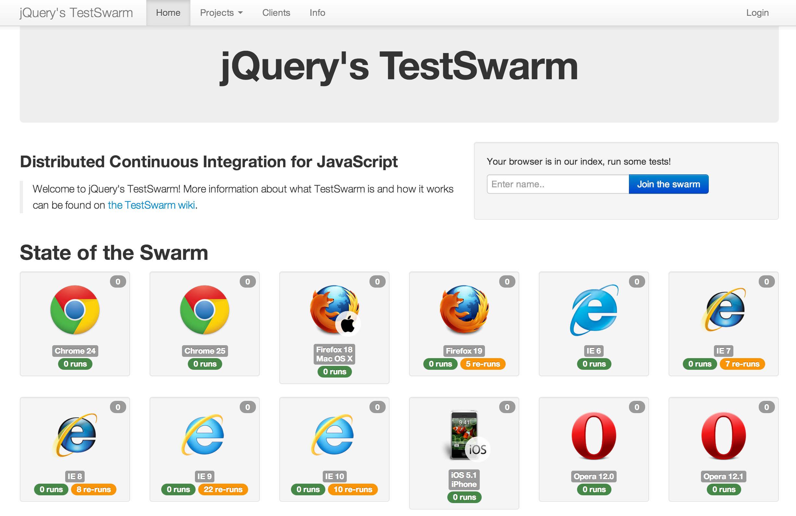
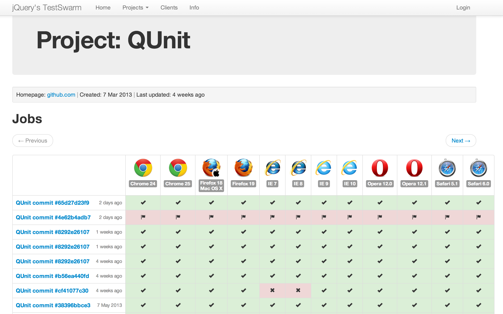
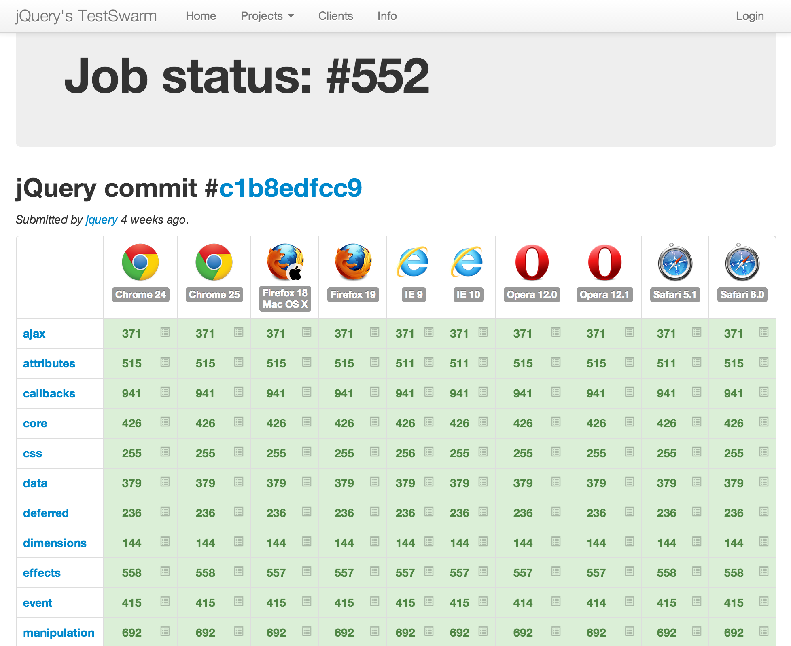
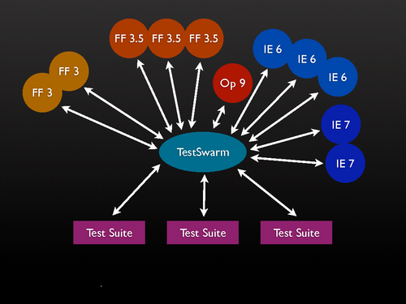

**TestSwarm** provides distributed continuous integration testing for JavaScript. It was originally created by [John Resig](http://ejohn.org/) as a basic tool to support unit testing of the [jQuery JavaScript library](http://jquery.com). It has since become a [jQuery Foundation](https://jquery.org/) project and is currently maintained by [Timo Tijhof](https://timotijhof.net).

## Philosophy

</a>

The primary goal of TestSwarm is to take the complicated, and time-consuming, process of running JavaScript test suites in multiple browsers and to grossly simplify it. It achieves this goal by providing all the tools necessary for creating a continuous integration workflow for your JavaScript project.

The ultimate result of TestSwarm are the project pages and job pages. 

Project page:

It shows source control commits (going vertically) by browser (going horizontally). 'Green' indicates the runs were are 100% passing, 'Red' indicates a failure, and 'Grey' means the runs are scheduled awaiting run

For more details on the individual jobs in a project, click the job title in the first column.

Job page:

This shows all individual runs of the job (going vertically) by browser. To view the run results of a completed run, click the "run results" icon inside the colored cell.

## Architecture

### Structure

From top to bottom, the structure is as follows
* A TestSwarm install has a number of authorized accounts. These are called "users" or "projects"
* Projects have a timeline consisting of jobs. An example of a job would for example be "`jquery:master #5ffa3ea7eea3fd9848fb5833e3306d390672a3e2`" in project "`jquery`".
* Jobs contain two mappings:
 * Runs: Every run represents a module that needs to be tested for a job. For example "selectors" or "attributes" are example of runs in a typical jQuery core test job.
 * Browsers: Every job has a set of browsers that it needs to validate against. TestSwarm will distribute all runs of a job to those browsers only.

The architecture is as follows:

* Clients join the swarm by connecting to the "run" page on the swarm server.
* The run page is used as the framework to run all tests inside. One user can open multiple clients  - and even multiple clients within a single browser. For example you could open 5 tabs in Firefox 3 each with a view of the test runner and would have 5 clients connected.
* The test runner periodically pings the server, asking for the latest "run" for this browser that hasn't been run yet. If there is one, it executes it (inside an iframe) and then submits the results back to the server. If there are no new runs available, the test runner goes back to sleep and tries again later.
* Every job also has a "run max" property. More about that below.

### Result correction.

An important aspect of TestSwarm is its ability to proactively correct bad results coming in from clients. As any web developer knows: Browsers are surprisingly unreliable (inconsistent results, browser bugs, network issues, etc.). Here are a few of the things that TestSwarm does to try and generate reliable results:

* If a client loses its internet connection or otherwise stops responding its dead results will be automatically cleaned up by the swarm.
* If a client is unable to communicate with the central server it'll repeatedly re-attempt to connect (even going so far as to reload the page in an attempt to clear up any browser-born issues).
* The client has a global timeout to watch for test suites that are uncommunicative.
* The client has the ability to watch for individual test timeouts, allowing for partial results to be submitted back to the server.
* Bad results submitted by clients (e.g. ones with errors, failures, or other timeouts) are automatically re-run in new clients in an attempt to arrive at a passing state (the number of times in which the test is re-run is determined by the submitter of the job).

All together these strategies help the swarm to be quite resilient to misbehaving browsers, flaky internet connections, or even poorly-written test suites.

For example if a job has a runmax of 3, and it fails the first time it will distribute it again (preferably to a different client with the same user agent, otherwise the same client will get it again later) until it either passes or hits the maximum of 3.

## How is TestSwarm Different From...

### Selenium

[Selenium](http://seleniumhq.org/) provides a quite-full stack of functionality. It has a test suite, a test driver, automated browser launching, and the ability to distribute test suites to many machines (using their grid functionality). There are a few important ways in which TestSwarm is different:
* TestSwarm is test suite agnostic. It isn't designed for any particular test runner and is capable of supporting any generic JavaScript test suite.
* TestSwarm is much more decentralized. Jobs can be submitted to TestSwarm without clients being connected - and will only be run once clients eventually connect.
* TestSwarm automatically corrects mis-behaving clients and malformed results.
* TestSwarm provides a full continuous integration experience (hooks in to source control and a full browser-by-commit view which is critical for determining the quality of commits).
* TestSwarm doesn't require any browser plugins or extensions to be installed - nor does it require that any software be installed on the client machines.

For a number of corporations Selenium may already suit your needs (especially if you already have a form of continuous integration set up).

### JSTestDriver and Other Browser Launchers

There are many other browser launching tools (such as [Watir](http://wtr.rubyforge.org/)) but all of them suffer from the same problems as above - and frequently with even less support for advanced features like continuous integration.

### Server-Side Test Running

A popular alternative to the process of launching browsers and running test suites is that of running tests in headless instances of browsers (or in browser simulations, like in Rhino). All of these suffer from a critical problem: At a fundamental level you are no longer running tests in an actual browser - and the results can no longer be guaranteed to be identical to an actual browser. Unfortunately nothing can truly replace the experience of running actual code in a real browser.