# Project history

TestSwarm was originally created by [John Resig](https://johnresig.com/) as a
basic tool to support unit testing of the [jQuery JavaScript
library](https://jquery.com). It later become a [Mozilla Labs](https://labs.mozilla.com/) project,
and has since moved again to become a [jQuery Foundation](https://jquery.org/history/) project.

## Visual history

## v1.1.0 (2023-03)

| Page | Screenshot
|---|---
| Clients page | 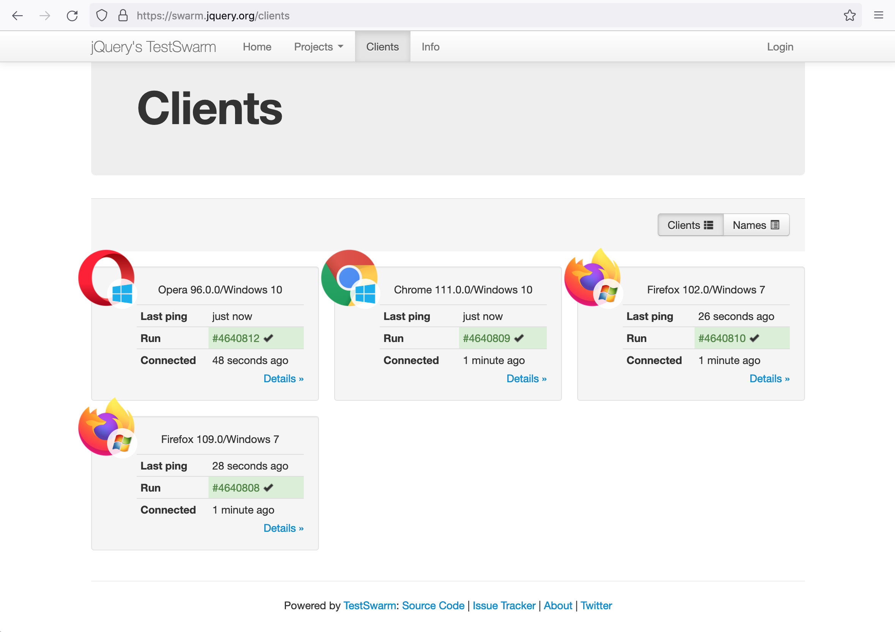 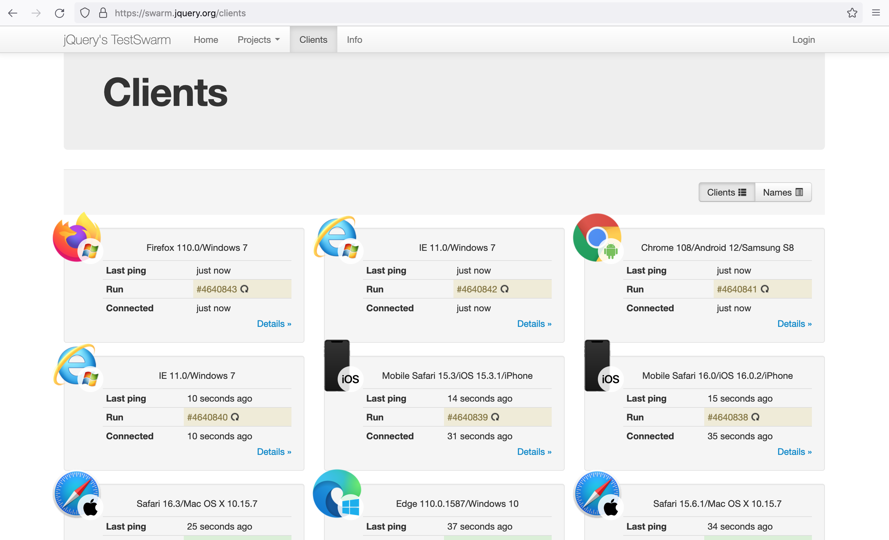
| Job page | 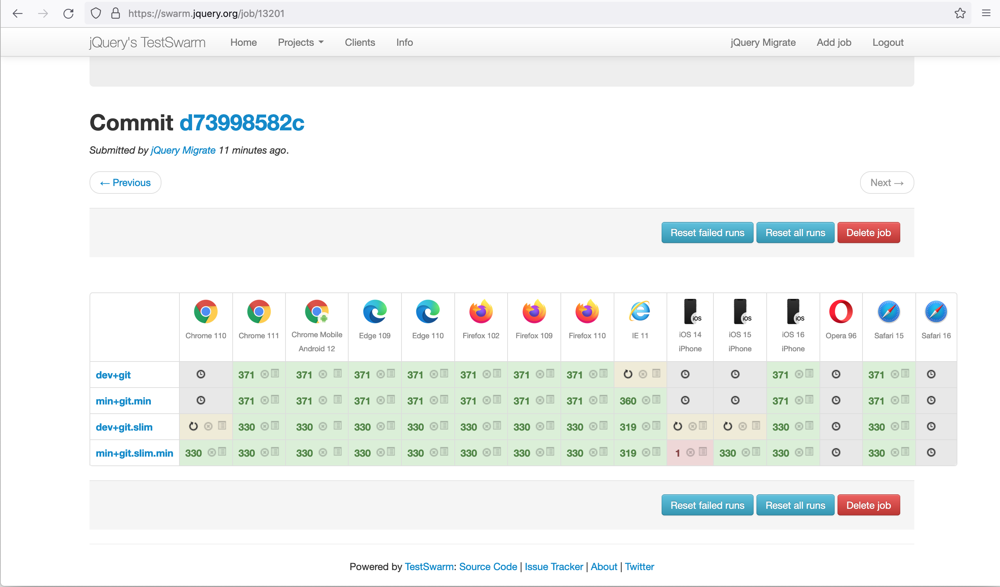

## v1.0.0-alpha (2013-06)

| Page | Screenshot
|---|---
| Home page |  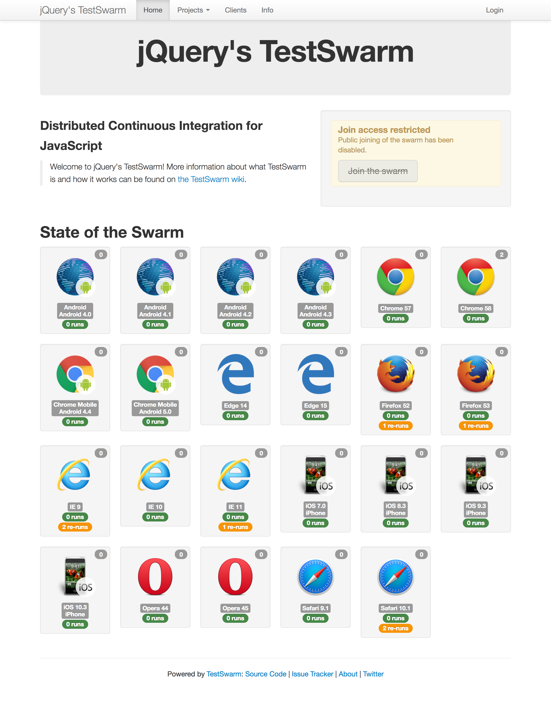
| Clients page | 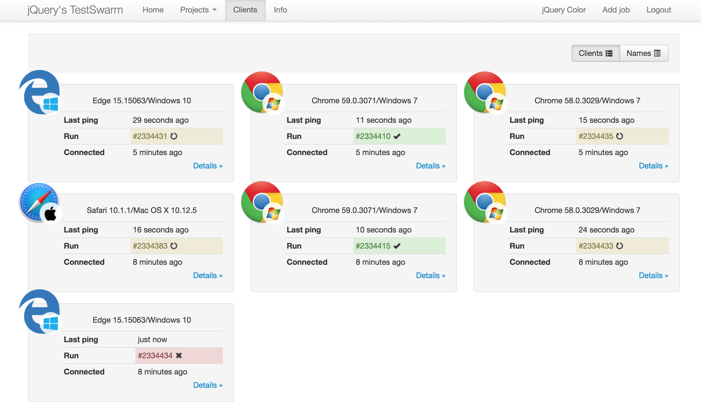 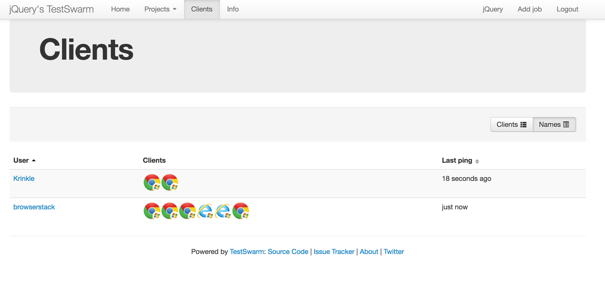
| Result page | 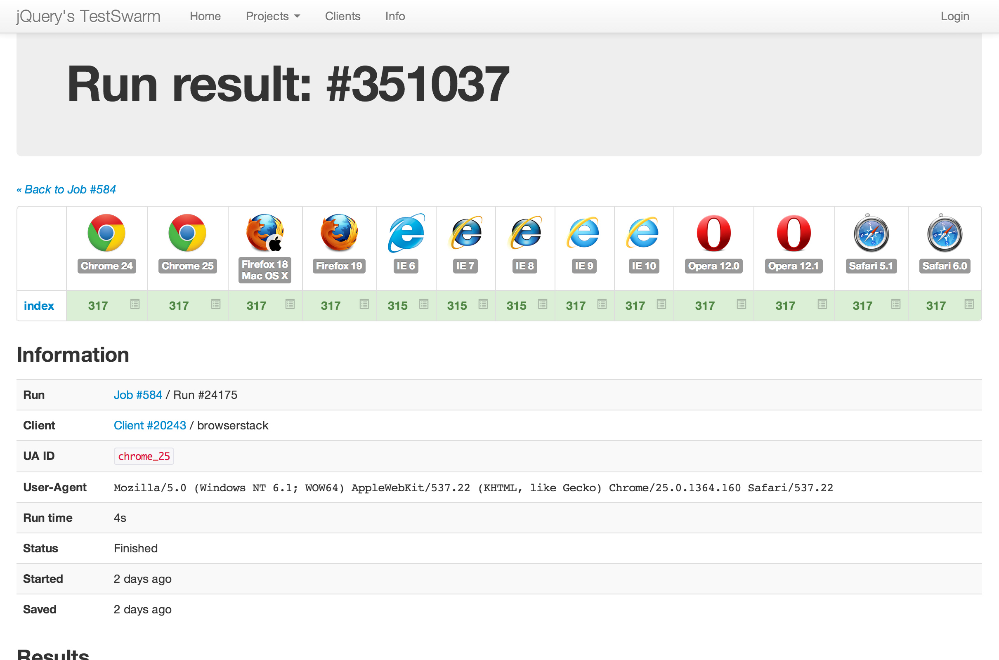 
| Job page | 
| Project page | 
| Projects page| 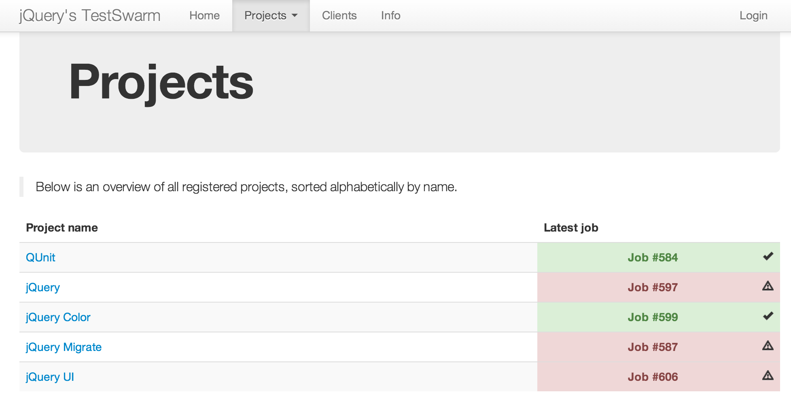
| Client page | 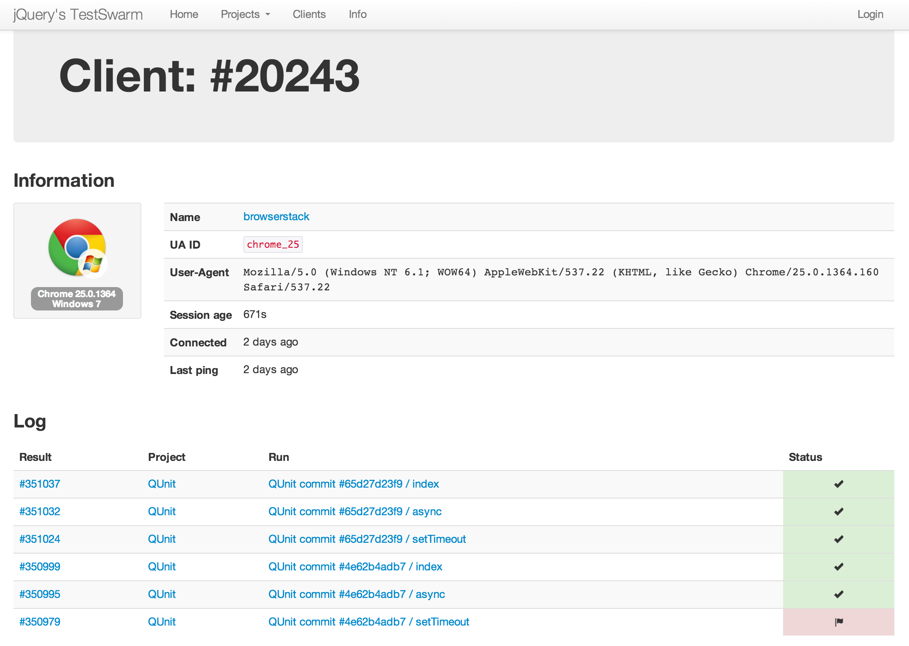

## v1.0.0-alpha (2012-11)

| Page | Screenshot
|---|---
| Home page | 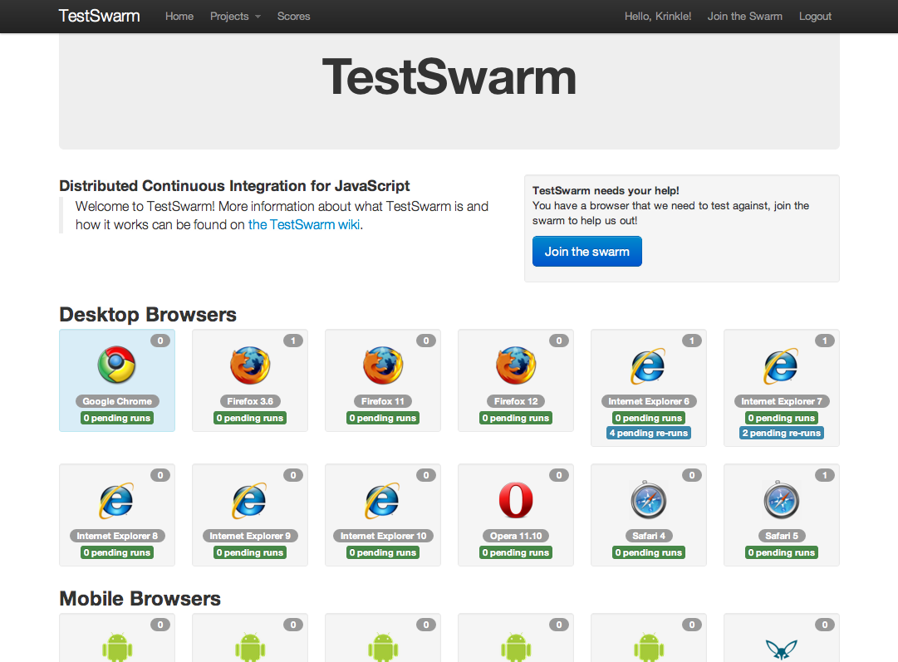
| Project page | 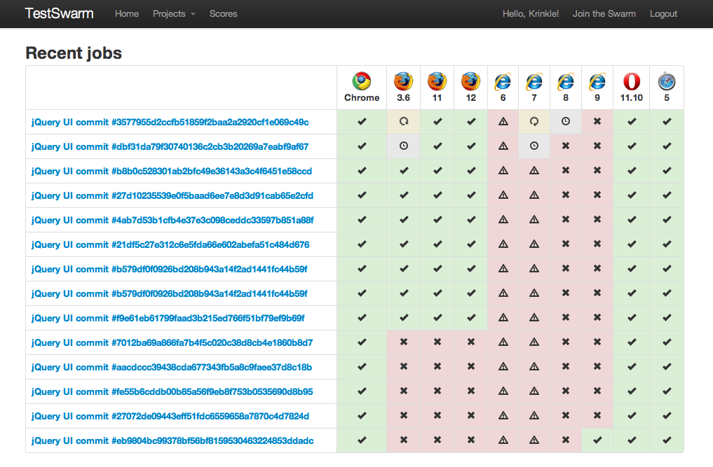
| Job page | 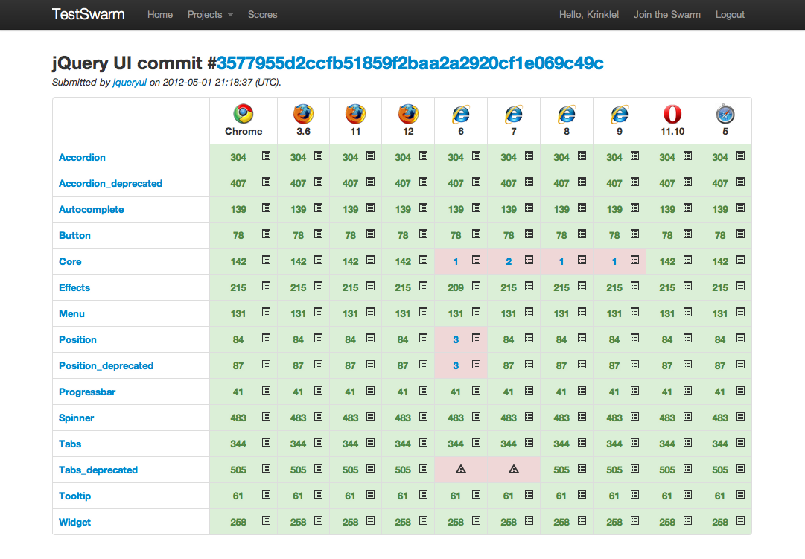

## v0.1.0 (2009)

* [Video: TestSwarm Walkthrough](https://vimeo.com/6281121), John Resig, 26 August 2009.
* [TestSwarm Alpha Open!](https://johnresig.com/blog/test-swarm-alpha-open/), John Resig, 26 August 2009.

| Page | Screenshot
|---|---
| Home page | 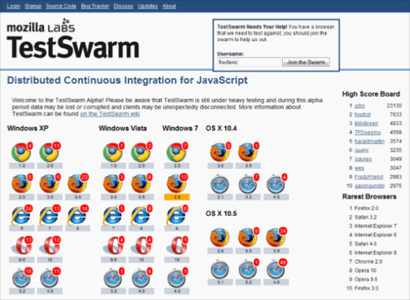
